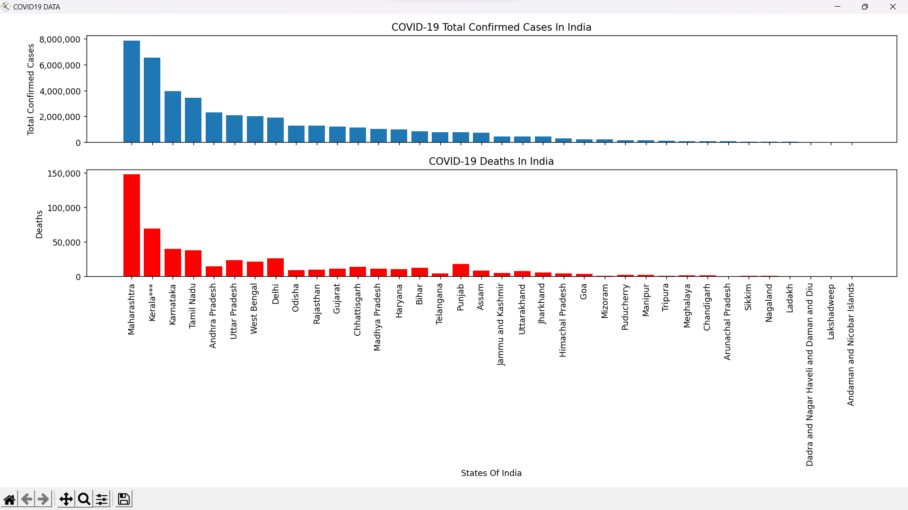

# COVID-19 Data Visualization

This repository contains a Python script that retrieves the latest COVID-19 data for India from an API and visualizes it using the matplotlib library. The script generates two bar charts: one displaying the total confirmed cases and another displaying the number of deaths in different states of India.

## Prerequisites

To run the script, you need to have the following installed:

- Python (version 3.6 or higher)
- pandas library
- matplotlib library
- requests library

## The script will retrieve the latest COVID-19 data and generate two bar charts:

- The first chart shows the total confirmed cases of COVID-19 in different states of India.
- The second chart shows the number of deaths due to COVID-19 in different states of India.

## Example Output

## Contributing

Contributions are welcome! If you find any issues or have suggestions for improvements, feel free to open an issue or submit a pull request.

## License

See the [LICENSE](LICENSE) file for more information.
